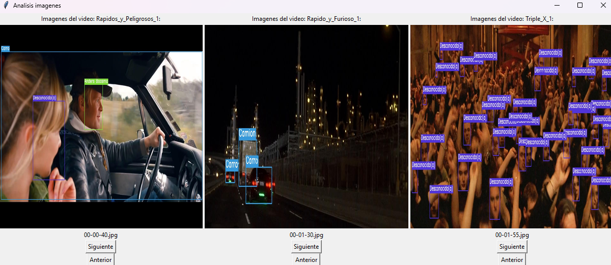
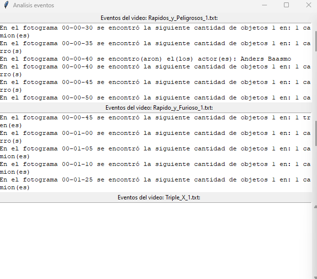
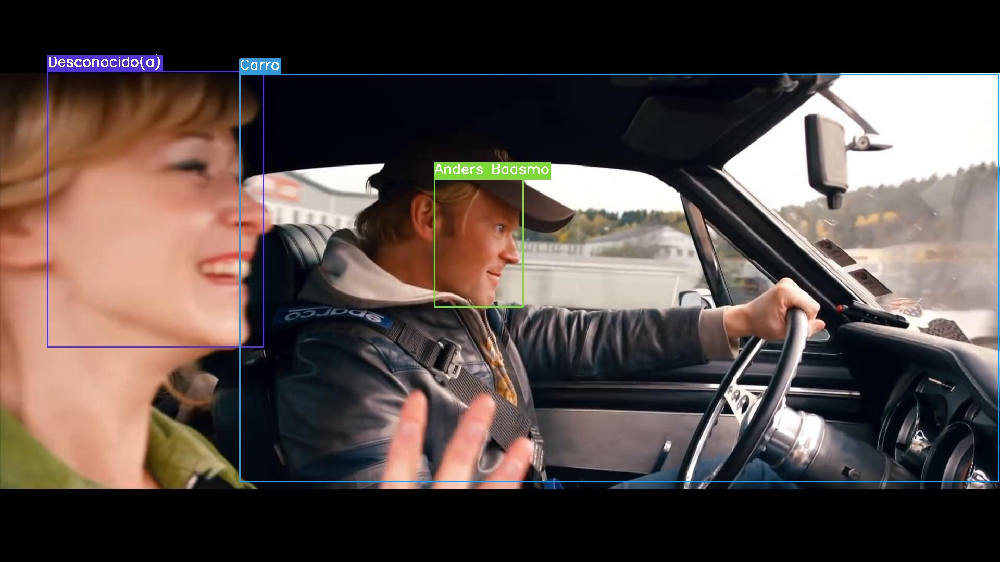
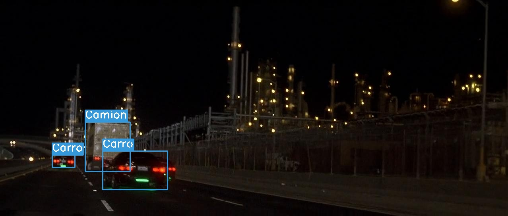
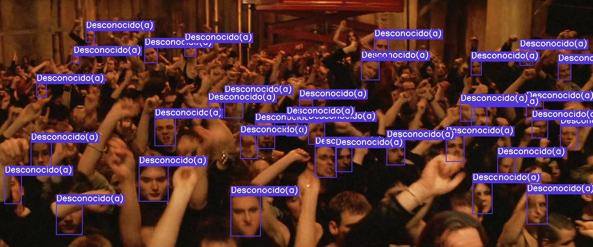

# AnalisisVideoAWSRekognitionYOLOv8

## Descripción del proyecto
El presente proyecto fue creado con la finalidad de detección de rostros de personas en videos (específicamente en películas), así como armas o vehículos, utilizando multiprocesamiento, para así procesar “N” cantidad de videos a la vez y mostrar resultados, sin necesidad de que se termine el programa por completo. Gracias a la extracción de fotogramas en los videos se puede conocer si algún objeto aparece en un fotograma en específico, así como reconocer si una persona en específico está en dicho fotograma.

## Evidencias de los resultados del proyecto
Características de la computadora con las que se realizaron las pruebas:
 - Disco utilizado: PCIe Gen4 x4 M.2 2280 Adata Legend 900 (velocidad de lectura 7000MB/s, escritura 5400 MB/s).
 - Tarjeta de video: NVIDIA RTX A2000 (6 GB GDDR6).
 - Procesador: Intel i7-13700F.
 - RAM: 64 GB.

En las siguientes imágenes se puede observar cómo el proyecto funciona analizando 3 videos a la vez:



En la siguiente imagen, el proyecto tardo aproximadamente 4 segundos en su búsqueda de caras y objetos:


En la siguiente imagen, el proyecto tardo aproximadamente 3 segundos en su búsqueda de caras y objetos:


En la siguiente imagen, el proyecto tardo aproximadamente 11 segundos en su búsqueda de caras y objetos:


## Explicación del modelo utilizado en el proyecto


Primeramente, se explicarán algunos conceptos importantes:
 - AWS: se refiere al servicio Amazon Web Services, el cual es un servicio en la nube con cual se puede integrar a aplicaciones para dar utilizar servicios de IA en imágenes, almacenamiento en la nube, bases de datos, etc.
 - S3: servicio de almacenamiento en la nube para desarrollo de aplicaciones de AWS.
 - Lambda: servicio automático que permite ejecutar código sin administrar servidores de AWS.
- Trigger o disparador: script que se ejecuta en una base de datos cuando se realiza una acción en específico.
 - DynamoDB: servicio de base de datos NoSQL de AWS.
 - GUI: es la interfaz gráfica de usuario, gracias a la utilización de imágenes u objetos gráficos se representa la información y acciones disponibles en la interfaz.
 - Multiprocesamiento: utilizar más de dos procesos a la vez en un sistema, pensado principalmente en la utilización de más de dos funciones al mismo tiempo.
 - Fotograma: imagen o cuadro el cual contiene la escena que sucede en un tiempo en específico de un video.
 - Amazon Rekognition: servicio de análisis de imágenes y video en la nube utilizando inteligencia artificial con el cual es capaz de detectar rostros de AWS.
 - YOLOv8: You Only Look Once, es un modelo de detección de objetos en imágenes y videos en tiempo real.
 - Modelo: en el contexto de este proyecto, se referirá a algoritmos de detección de objetos dentro de YOLOv8.

El proyecto fue creado en el lenguaje de programación Python, este sigue una serie de 6 pasos que se detallaran a continuación:
 1. Este hace uso de la función Entrenamiento, esta realiza una iteración de la carpeta Entrenamiento donde están las fotos de las personas con las cuales se va a entrenar el proyecto. Cada imagen debe estar en formato .jpg y a la vez, deben seguir una regla, la cual es que en el nombre de la imagen debe venir el nombre de la persona a la cual va a estar asociada, debe venir cada nombre y apellido con la primera letra en mayúscula, no debe haber espacios, obligatoriamente deben venir con (_), por ejemplo: Vin_Diesel. Para cada imagen de la carpeta Entrenamiento se enviará a AWS utilizando S3 se subirá cada imagen con su respectivo nombre, agregando a su descripción el nombre a la cual la imagen está asociada sin los (_), luego, Lambda actuará como un trigger o disparador, donde, por cada imagen se creará un ID y se almacenará en la columna de RekognitionId, así como el nombre de la descripción de la imagen se almacenará en la columna FullName en la tabla llamada face_recognition de DynamoDB.
 2. Usando la función InterfazGraficaVideosBusqueda, básicamente, es un GUI. El usuario seleccionará máximo 3 videos en formato .mp4 para ser utilizados dentro del proyecto, por defecto, el proyecto buscará los videos en la carpeta Video, pero, el usuario podrá escogerlos en otra ubicación.
 3. Usando la función Programa, el multiprocesamiento se encargará a partir de ahora de las próximas tareas que se explicaran en los siguientes puntos. Cuando este se ejecute, primeramente, se utilizará la función EliminarCarpetas, que se encargara de borrar la carpeta Fotograma y más adelante se creara nuevamente, de esta manera se borraran archivos almacenados anteriormente.
 4. Con el uso de la función ExtraerFotogramas, con los videos solicitados en el paso 2, se hará una iteración de estos, con la utilidad de extraer sus fotogramas en formato .jpg en un intervalo de cada 5 segundos. Todos los fotogramas se guardarán en la carpeta Fotograma, en subcarpetas, estas tendrán el nombre del video al cual se está ejecutando en el proyecto.
 5. Utilizando las funciones DetectarPersona y EncontrarCarasObjetos se realiza una iteración de los fotogramas de las subcarpetas, primeramente, se verificará si existe al menos una cara en el fotograma, si existe, se hará una iteración de las imágenes existentes en S3 y con Amazon Rekognition se verificará que exista alguna coincidencia, si existe, se le preguntará a DynamoDB como se llama la persona. Una vez, con estos datos, se registrará en un archivo .txt con el nombre de dicho video el nombre de la imagen que será el tiempo del fotograma del video y el nombre de la o las personas encontradas, además de esto, se escribirá en el fotograma analizado los cuadros de todas las caras encontradas, así como su nombre, si alguna cara no coincide con ninguna de S3 se colocará como desconocido y no escribirá ningún resultado en el archivo .txt. Además, utilizando la función InterfazGraficaResultadosTexto se mostrarán los resultados de los archivos .txt de cada video analizado en tiempo real.
 6. En este último paso se utilizaron las funciones EncontrarObjetos y EncontrarCarasObjetos, se realiza una iteración de los fotogramas de las subcarpetas, utilizando YOLOv8 con 2 modelos diferentes se encontrarán los siguientes objetos: bicicletas, carros, motocicletas, aviones, buses, trenes, camiones, botes, armas y cuchillos. Se verificará que exista alguna coincidencia, si existe, se le preguntará a YOLOv8 como se llama el o los objetos encontrados. Una vez, con estos datos, se registrará en el mismo archivo .txt del paso 5 el nombre de la imagen que será el tiempo del fotograma del video y el nombre del o los objetos encontrados, así como la cantidad de estos, además de esto, se escribirá en el fotograma analizado los cuadros de todos los objetos encontradas, así como su nombre, si no se encontró al menos un objeto este no escribirá ningún resultado en el archivo .txt. Además, utilizando la función InterfazGraficaResultadosImagenes se mostrarán los resultados de los fotogramas de cada video analizado en tiempo real.


## Instrucciones de Instalación
El presente proyecto fue credo utilizando Windows. Es necesario tener instalado Python, así como las siguientes librerías:
 - os 
 - shutil
 - threading
 - time
 - boto3
 - io
 - cv2
 - tkinter
 - pil
 - ultralytics
 - moviepy.editor
 
Una vez instaladas, es necesario tener una cuenta en AWS para acceder a los servicios de: Lambda, S3, Rekognition, y DynamoDB, luego, seguir los siguientes pasos:
 1. Se deberá acceder a AWS y buscar IAM (Identity and Access Management), dentro, se debe acceder a la sección que dice Administración del acceso. Una vez en esta sección se mostrará el Panel de IAM, y se deberá tocar el botón que dice Administrar las claves de acceso. Luego, se debe ir donde dice Claves de acceso, tocar el botón que dice Crear clave de acceso, se nos pedirá confirmación, se acepta, una vez creado, se debe apuntar la Clave de acceso y la Clave de acceso secreta, ya que se necesitaran más adelante.
 2. En el CMD de Windows se debe tener acceso a la carpeta donde se encuentra el repositorio clonado, se debe ejecutar el siguiente comando: 
```
aws configure
```
 3. Se pedirá primeramente la Clave de acceso, la Clave de acceso secreta y cuando se pida la región se deberá colocar lo siguiente: 
```
us-east-1
```
 4. Una vez hecho esto, se debe ejecutar el siguiente comando: 
```
aws rekognition create-collection --collection-id actores --region us-east-1
```
 5. Se desplegará un mensaje de que fue creado. Luego, se debe ejecutar este otro comando:
```
aws dynamodb create-table --table-name face_recognition --attribute-definitions AttributeName=RekognitionId,AttributeType=S --key-schema AttributeName=RekognitionId,KeyType=HASH --provisioned-throughput ReadCapacityUnits=1,WriteCapacityUnits=1 --region us-east-1
```
 6. Se desplegará un mensaje de que fue creado. El ultimo comando sería el siguiente:
```
aws s3 mb s3://actores --region us-east-1
```
 7. En IAM, se debe acceder a la sección de Roles, darle en el botón que dice Crear rol, seleccionar Servicio de AWS, en Servicio o caso de uso se debe escoger Lambda, se debe continuar y donde dice Nombre del rol se debe escribir el siguiente y después darle a Crear rol: 
```
face_recognition 
```
 8. En IAM, se debe acceder a la sección de Roles nuevamente, se debe buscar el rol creado anteriormente y tocar su nombre, una vez hecho esto, se debe tocar el botón que dice Agregar permisos y luego donde dice Crear política insertada, luego, se debe tocar el botón que dice JSON se debe copiar el siguiente código: 
```
{
	"Version": "2012-10-17",
	"Statement": [
		{
			"Effect": "Allow",
			"Action": [
				"logs:CreateLogGroup",
				"logs:CreateLogStream",
				"logs:PutLogEvents"
			],
			"Resource": "arn:aws:logs:*:*:*"
		},
		{
			"Effect": "Allow",
			"Action": [
				"s3:GetObject"
			],
			"Resource": [
				"arn:aws:s3:::actores/*"
			]
		},
		{
			"Effect": "Allow",
			"Action": [
				"dynamodb:PutItem"
			],
			"Resource": [
				"arn:aws:dynamodb:us-east-1:637423633559:table/face_recognition"
			]
		},
		{
			"Effect": "Allow",
			"Action": [
				"rekognition:IndexFaces"
			],
			"Resource": "*"
		}
	]
}
```
 9. Donde dice "Resource", se debe modificar la línea que está en los corchetes (la que está entre comillas):
```
			"Resource": [
				"arn:aws:dynamodb:us-east-1:637423633559:table/face_recognition"
			]
```
 10. Para modificar dicha línea de código se debe hacer lo siguiente: en DynamoDB, se debe acceder a la sección de Tablas, se debe tocar la que dice face_recognition, una vez dentro se debe bajar a la sección que dice Información adicional y tocar dicho botón, finalmente, el código que debemos reemplazar en el paso anterior se deberá sustituir con el texto que aparece en la leyenda de Nombre de recurso de Amazon (ARN), una vez sustituido se debe tocar el botón siguiente. Donde dice Nombre de la política se debe colocar el siguiente nombre y darle al botón de Crear política:
```
face_recognition_policy
```
 11. En Lambda, se debe acceder a la sección de Funciones y darle al botón que dice Crear una funcion, luego, donde dice Nombre de la función se deberá colocar el siguiente:
```
face_recognition
```
 12. Una vez colocado el nombre, donde dice Tiempo de ejecucicion se deberá seleccionar la versión de Python más moderna, luego, se debe tocar el botón que dice Cambiar el rol de ejecución predeterminado, luego, tocar el botón que dice Uso de un rol existente, luego se deberá seleccionar el que dice:
```
face_recognition
```
 13. Una vez colocado, se deberá tocar el botón que dice Crear una función, luego en Lamda, se debe acceder a la sección de Funciones nuevamente, se debe buscar la funcion creada anteriormente y tocar su nombre, una vez hecho esto, hay que bajar hasta donde dice Código fuente y tocar el botón que dice Configuración, luego, el botón que dice Desencadenadores, luego, tocar el botón que dice Agregar desencadenador, luego, donde dice Seleccionar un origen se busca S3 y se escoge. Donde dice Bucket se escoge el siguiente:
```
actores
```
 14. Donde dice Tipos de eventos hay que seleccionar el que dice Todos los eventos de creación de objetos, luego, donde dice Prefijo – Opcional se deberá escribir el siguiente:
```
index/
```
 15. Una vez escrito, se deberá aceptar el check que dice Invocación recurrente, una vez seleccionado, se deberá tocar el botón de Agregar, luego, en Lamda, se debe acceder a la sección de Funciones nuevamente, se debe buscar la funcion creada anteriormente y tocar su nombre, una vez hecho esto, hay que bajar hasta donde dice Código fuente y donde esta el IDE agregar el siguiente código:
```
from __future__ import print_function

import boto3
from decimal import Decimal
import json
import urllib

print('Loading function')

dynamodb = boto3.client('dynamodb')
s3 = boto3.client('s3')
rekognition = boto3.client('rekognition')


# --------------- Helper Functions ------------------

def index_faces(bucket, key):

    response = rekognition.index_faces(
        Image={"S3Object":
            {"Bucket": bucket,
            "Name": key}},
            CollectionId="actores")
    return response
    
def update_index(tableName,faceId, fullName):
    response = dynamodb.put_item(
        TableName=tableName,
        Item={
            'RekognitionId': {'S': faceId},
            'FullName': {'S': fullName}
            }
        ) 
    
# --------------- Main handler ------------------

def lambda_handler(event, context):

    # Get the object from the event
    bucket = event['Records'][0]['s3']['bucket']['name']
    print("Records: ",event['Records'])
    key = event['Records'][0]['s3']['object']['key']
    print("Key: ",key)
    # key = key.encode()
    # key = urllib.parse.unquote_plus(key)

    try:

        # Calls Amazon Rekognition IndexFaces API to detect faces in S3 object 
        # to index faces into specified collection
        
        response = index_faces(bucket, key)
        
        # Commit faceId and full name object metadata to DynamoDB
        
        if response['ResponseMetadata']['HTTPStatusCode'] == 200:
            faceId = response['FaceRecords'][0]['Face']['FaceId']

            ret = s3.head_object(Bucket=bucket,Key=key)
            personFullName = ret['Metadata']['fullname']

            update_index('face_recognition',faceId,personFullName)

        # Print response to console
        print(response)

        return response
    except Exception as e:
        print(e)
        print("Error processing object {} from bucket {}. ".format(key, bucket))
        raise e
```
 16. Una vez colocado, se deberán guardar los cambios. Cuando se tenga configurado AWS tocará la parte del entrenamiento de este, con el código de Python descargado junto con todas las librerías necesarias se deberá ejecutar el código en una carpeta deseada y luego cerrarlo. Una vez cerrado, se deberá buscar donde esta la carpeta entrenamiento y agregar las fotos de las personas con las cuales se desea realizar el reconocimiento facial, estas deberán estar en un formato .jpg, a la vez, el nombre de cada imagen debe tener el nombre de la persona a la cual pertenece respetando un formato como el siguiente:
```
Vin_Diesel.jpg
```
 17. Se debe agregar cada nombre y apellido con la primera letra en mayúscula, a la vez, debe haber obligatoriamente los (_) como espacios. Una vez agregadas las fotos de las personas, se deberá ejecutar nuevamente el código, en la ventana abierta, se deberá tocar el botón que dice Entrenar y esperar a que se haga la operación, al final, se mostrara un mensaje de confirmación que se hizo correctamente (este paso solo se deberá realizar una única vez), todas las imágenes creadas se almacenaran en el S3 creado anteriormente que funciona como un almacenamiento en la nube, luego, cada imagen tendrá un ID para el reconocimiento facial en la tabla de DynamoDB.
 18. Una vez presionado el botón anterior, se deberán escoger solo 3 videos con los cuales se hará el reconocimiento facial y los objetos encontrado, una vez seleccionados, se deberá tocar el botón que dice Continuar, se descargara el modelo de YOLOv8 para detección de vehículos, este paso solo se realizara una vez este modelo este descargado. Una vez descargado, se recomienda cerrar el código y volverlo a ejecutar, y ya estará configurado el entorno.

## Explicación de cada librería
 - os: Es utilizada para el manejo de carpetas dentro del proyecto.
 - shutil: Su función es manipular las carpetas que existan dentro de una carpeta.
 - threading: Gracias a esta, se puede utilizar el multiprocesamiento.
 - time: Utilizada para pausar la ejecución en ciertas partes del código en el multiprocesamiento.
 - boto3: Es para utilizar los distintos servicios de AWS (Amazon Web Services), en específico el S3 (subir imágenes del entrenamiento en el almacenamiento de la nube), DynamoDB (base de datos que permite manejar a través de una tabla cada una de las personas registradas en el entrenamiento) y Rekognition (detección de personas y rostros).
 - io: Es implementada en el manejo de archivos, como en los fotogramas de los videos.
 - cv2: Creación de etiquetas y cuadros de caras u objetos detectados en los fotogramas de los videos.
 - tkinter: Utilización de interfaz gráfica en Python.
 - pil: Manejo de imágenes para YOLOv8 y AWS.
 - ultralytics: librería necesaria para la utilización de YOLOv8 para detección de objetos.
 - moviepy.editor: Su función es dividir en fotogramas los videos seleccionados.

## Guía de Uso 
Una vez instalado y configurado el sistema, se deberá ejecutar el código, escoger máximo 3 videos con los cuales el programa trabajara (solo se pueden utilizar videos en formato .mp4) y darle al botón de Continuar, una vez hecho esto, se ejecutara en multiprocesamiento una extracción de fotogramas donde se mostraran 2 ventanas distintas, una donde se podrá revisar fotograma por fotograma del video los resultados que se encontraron en estos, otra que explicara cuantos objetos se encontraron, cuales en específico así como cuales personas se encontraron y en que fotograma. Los resultados se podrán apreciar en tiempo real sin necesidad de que el programa finalice.

## Documentacion de API
 - AWS Rekognition: https://aws.amazon.com/es/rekognition/
 - YOLOv8: https://docs.ultralytics.com/

## Contribuciones y Créditos
 - Tech Raj. (27 de junio de 2022). Create your own Face Recognition Service with AWS Rekognition! [Archivo de Vídeo]. YouTube. https://www.youtube.com/watch?v=oHSesteFK5c&t=867s
 - GitHub. (23 de diciembre de 2023). Weapons-and-Knives-Detector-with-YOLOv8. https://github.com/JoaoAssalim/Weapons-and-Knives-Detector-with-YOLOv8


